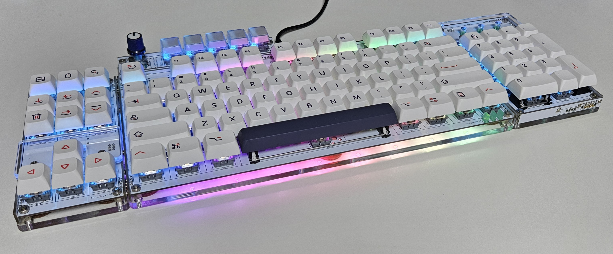
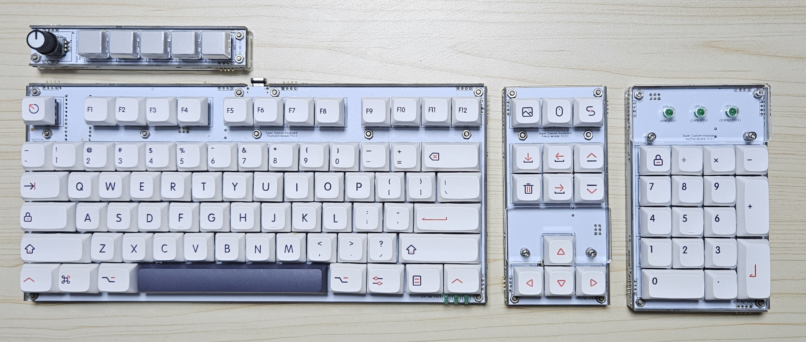

# SCK_modules

## Description
Firmware for **modular submodules** of the SCK (Super Custom Keyboard) system.  
Each module runs on its own MCU and communicates with the main controller via I2C.
---

## Development Environment

### main
- **IDE**: PlatformIO (or arduino IDE)
- **Board**:  
  - Arduino Pro Micro (ATmega32U4, 5V, 16MHz)
### modules
- **IDE**: Microchip Studio (or AVR Studio)  
- **MCU**:  
  - ATmega8A

---

## Modules Overview

- Each module has its own firmware and schematic.

### SCK Main
- **MCU**: ATmega32U4
- I²C Address : none. just master
- Attached to the keyboard module
- [SCK_main](SCK_main/README.md)

### SCK Keyboard Module
- **MCU**: ATmega8A
- I²C Address : 0x10 - 0x17 (0x10 default)
- [SCK_Keyboard](SCK_Keyboard/README.md)

### SCK Keypad Module
- **MCU**: ATmega8A
- I²C Address : 0x18 - 0x1B (0x18 default)
- [SCK_keyPad](SCK_keyPad/README.md)

### SCK Fnkey Module
- **MCU**: ATmega8A
- I²C Address : 0x1C - 0x1F (0x1C default)
- [SCK_Fnkey](SCK_Fnkey/README.md)

### SCK Macro Module
- **MCU**: ATmega8A
- I²C Address : 0x20 - 0x2F (0x20 default)
- [SCK_Macro](SCK_Macro/README.md)

## How to upload firmware

### main board
1. Press `D_PG` key (Default : FN1 + `\``)
2. The LED will blink slowly.
3. You can upload firmware to main board.
4. Press ESC to cancel programming mode.
### modules
1. You will need an AVR ISP that can supply power to target board.
2. Connect AVR ISP to ISP port. (2x3 header)
3. Program to module. (DO NOT press any key while programming)

---

## Communication (I2C)

- Each module acts as an **I2C slave** with a fixed address (it can be set by jumpers in each modules)
- Reports key or encoder input when polled by the main controller  

---

## Used Libraries

- [**pololu-led-strip-avr**](https://github.com/pololu/pololu-led-strip-avr):  
  Used for WS2812/APA102 LED strip control.
- [**NicoHood/HID**](https://github.com/NicoHood/HID):  
  Used for enhanced USB HID support on ATmega32U4 boards.