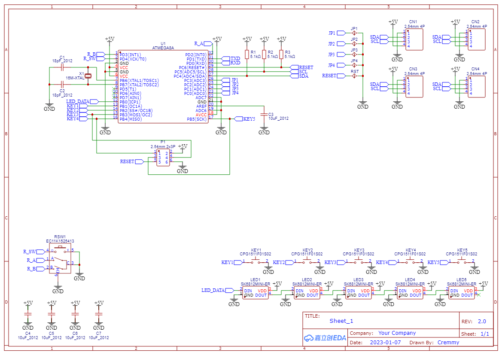

# SCK_modules

## 📌 Description
Firmware for **modular submodules** of the SCK (Super Custom Keyboard) system.  
Each module runs on its own MCU and communicates with the main controller via I2C.
- [SCK_main](https://github.com/Crem2y/SCK_main)
---

## 🔧 Development Environment

- **IDE**: Microchip Studio (or AVR Studio)  
- **MCU**:  
  - ATmega8A  

---

## 📚 Used Libraries

- [**pololu-led-strip-avr**](https://github.com/pololu/pololu-led-strip-avr):  
  Used for WS2812/APA102 LED strip control.

---

## 🔌 Modules Overview

Each module has its own firmware and schematic.

### 🔹 SCK Macro Module
- **MCU**: ATmega8A  
- **Schematic**:  
  

---

### 🔹 SCK Keypad Module
- **MCU**: ATmega8A  
- **Schematic**:  
  .png)  
  .png)  
  .png)

---

### 🔹 SCK Fnkey Module
- **MCU**: ATmega8A  
- **Schematic**:  
  .png)  
  .png)

---

### 🔹 SCK Keyboard Module
- **MCUs**: ATmega8A + Arduino Pro Micro (ATmega32U4, 5V, 16MHz)  
- **Schematic**:  
  .png)  
  .png)  
  .png)

---

## 📡 Communication (I2C)

- Each module acts as an **I2C slave** with a fixed address  
- Reports key or encoder input when polled by the main controller  
